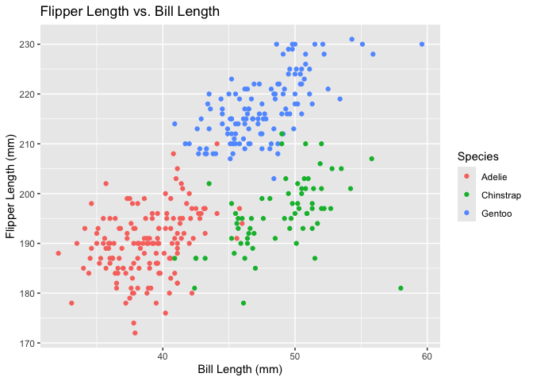

p8105_hw1_rw3033
================

# Problem 1

Load the penguins dataset

``` r
data("penguins", package = "palmerpenguins")
```

Describe the dataset

``` r
library(tidyverse)
```

    ## ── Attaching core tidyverse packages ──────────────────────── tidyverse 2.0.0 ──
    ## ✔ dplyr     1.1.4     ✔ readr     2.1.5
    ## ✔ forcats   1.0.0     ✔ stringr   1.5.1
    ## ✔ ggplot2   3.5.1     ✔ tibble    3.2.1
    ## ✔ lubridate 1.9.3     ✔ tidyr     1.3.1
    ## ✔ purrr     1.0.2     
    ## ── Conflicts ────────────────────────────────────────── tidyverse_conflicts() ──
    ## ✖ dplyr::filter() masks stats::filter()
    ## ✖ dplyr::lag()    masks stats::lag()
    ## ℹ Use the conflicted package (<http://conflicted.r-lib.org/>) to force all conflicts to become errors

``` r
names(penguins)
```

    ## [1] "species"           "island"            "bill_length_mm"   
    ## [4] "bill_depth_mm"     "flipper_length_mm" "body_mass_g"      
    ## [7] "sex"               "year"

``` r
nrow(penguins)
```

    ## [1] 344

``` r
ncol(penguins)
```

    ## [1] 8

``` r
mean(pull(penguins, flipper_length_mm), na.rm = TRUE)
```

    ## [1] 200.9152

Description: There are 3 kinds of penguin species. The dataset contains
344 rows and 8 columns. The 8 variables (column names) include: species,
island, bill_length_mm, bill_depth_mm, flipper_length_mm, body_mass_g,
sex, and year. The mean flipper length is 200.9152 mm.

Make a scatterplot

``` r
library(ggplot2)

ggplot(penguins, aes(x = bill_length_mm, y = flipper_length_mm, color = species)) +
  geom_point(na.rm = TRUE) +
  labs(title = "Flipper Length vs. Bill Length",
       x = "Bill Length (mm)",
       y = "Flipper Length (mm)",
       color = "Species")
```

<!-- -->
Export the scatterplot

``` r
ggsave("scatterplot_penguins.png")
```

    ## Saving 7 x 5 in image

# Problem 2

Create a data frame

``` r
library(tidyverse)

random_sample = rnorm(10)
logical_vector = random_sample > 0
character_vector = letters[1:10]
factor_vector = factor(rep(c("low", "medium", "high"), length.out = 10)) 

df = tibble(
  random_sample = random_sample,
  logical_vector = logical_vector,
  character_vector = character_vector,
  factor_vector = factor_vector
)

view(df)
```

Calculate the means of each variable

``` r
mean(pull(df, random_sample))
```

    ## [1] 0.8601143

``` r
mean(pull(df, logical_vector))
```

    ## [1] 0.6

``` r
mean(pull(df, character_vector))
```

    ## Warning in mean.default(pull(df, character_vector)): argument is not numeric or
    ## logical: returning NA

    ## [1] NA

``` r
mean(pull(df, factor_vector))
```

    ## Warning in mean.default(pull(df, factor_vector)): argument is not numeric or
    ## logical: returning NA

    ## [1] NA

Description: random_sample works, since it is numeric; logical_vector
works, since logical TRUE is treated as 1 and FALSE as 0;
character_vector gives an error, since characters cannot be averaged;
factor_vector gives an error, since factors are categorical, not
numeric.

Write a code chunk that applies the as.numeric function to the logical,
character, and factor variables

``` r
as.numeric(pull(df,logical_vector))  
```

    ##  [1] 1 1 1 1 0 0 1 1 0 0

``` r
as.numeric(pull(df,character_vector)) 
```

    ## Warning: NAs introduced by coercion

    ##  [1] NA NA NA NA NA NA NA NA NA NA

``` r
as.numeric(pull(df,factor_vector))
```

    ##  [1] 2 3 1 2 3 1 2 3 1 2

Description:
as.numeric(df$random_sample)  works, since it is already numeric;
as.numeric(df$logical_vector) works, as TRUE becomes 1, FALSE becomes 0;
as.numeric(df$character_vector) gives an error, since characters cannot be converted;
as.numeric(df$factor_vector) works, it converts factor levels to their
vector levels. Since these numbers denotes the vector levels, they do
not make sense in calculating the mean.
